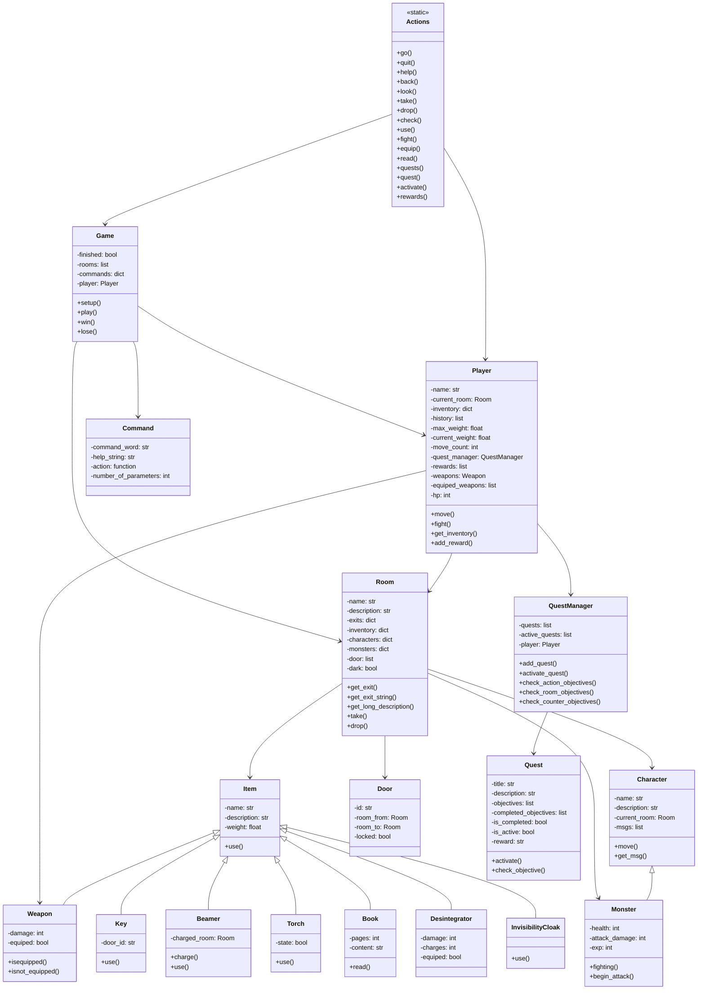

# TBA - Aventure Textuelle Mystérieuse

## À propos du Jeu

**TBA** est un jeu d'aventure textuel immersif où vous explorez un manoir ancien rempli de secrets, de dangers et de trésors cachés. Développé en Python, ce jeu vous plonge dans une expérience narrative interactive où chaque choix compte.

### Histoire
Vous êtes un aventurier intrépide qui pénètre dans un manoir légendaire. Les pièces sont interconnectées par des passages secrets, des portes verrouillées et des zones sombres. Votre objectif : découvrir tous les mystères du manoir, collecter des artefacts puissants et affronter des créatures surnaturelles.

### Première Partie
1. Entrez votre nom quand demandé
2. Tapez `help` pour voir toutes les commandes
3. Commencez par `look` pour examiner votre environnement
4. Utilisez `go <direction>` pour explorer

## Gameplay

### Exploration
- **9 pièces** à découvrir : Hall, Cuisine, Salon, Bibliothèque, Laboratoire, etc.
- **Déplacements** : Utilisez les directions cardinales (nord, sud, est, ouest) ou verticales (haut, bas)
- **Éclairage** : Certaines pièces sont sombres - trouvez une torche !

### Objets et Inventaire
- **Limite de poids** : 10 kg maximum
- **Types d'objets** :
  -  **Clés** : Pour ouvrir des portes verrouillées
  -  **Armes** : Pour combattre les monstres
  -  **Livres** : Contiennent des énigmes et des connaissances
  -  **Torche** : Éclaire les zones sombres
  -  **Beamer** : Téléportation instantanée
  -  **Cape d'invisibilité** : Évite les combats

### Système de Combat
- **Combat au tour par tour**
- **Choix d'armes** : Sélectionnez votre arme avant le combat
- **Fuite possible** : Option de retraite stratégique
- **Points de vie** : Gérez votre santé (35 PV de base)

### Quêtes et Progression
Le jeu propose un système de quêtes riche :

| Quête | Objectif | Récompense |
|-------|----------|------------|
| Dénicheur de Clés | Collecter 3 clés spéciales | Maître des Serrures |
| Le Petit Combattant | Vaincre la Gargouille | Chasseur de Monstres |
| En Quête d'Enigme | Résoudre une énigme | Sage Érudit |
| Le Désintégrateur | Trouver l'arme ultime | Technomage |
| Le Gardien | Vaincre le Gardien ailé | Protecteur des Airs |
| Le Boss | Tuer le démon | Héros Légendaire |

## Commandes Complètes

### Mouvement et Exploration
```
go <direction>    - Se déplacer (nord/sud/est/ouest/haut/bas)
look              - Examiner la pièce actuelle
back              - Retourner à la pièce précédente
```

### Gestion d'Inventaire
```
take <objet>      - Ramasser un objet
drop <objet>      - Déposer un objet
check             - Voir son inventaire
equip <arme>      - Équiper une arme
```

### Interactions
```
use <objet>       - Utiliser un objet
charge            - Charger le beamer
beamer            - Se téléporter
talk <pnj>        - Parler à un personnage
read <livre>      - Lire un livre
fight <monstre>   - Combattre une créature
```

### Quêtes et Informations
```
quests            - Lister toutes les quêtes
quest <nom>       - Détails d'une quête
activate <nom>    - Activer une quête
rewards           - Voir ses récompenses
status            - État du joueur
```

### Utilitaires
```
help              - Afficher l'aide
quit              - Quitter le jeu
```

## Guide de Développement

### Architecture du Code

Le projet suit une architecture orientée objet modulaire :

```
     TBA/
├──  game.py          # Moteur principal du jeu
├──  player.py        # Classe du joueur
├──  room.py          # Gestion des pièces
├──  item.py          # Système d'objets
├──  character.py     # PNJ et monstres
├──  door.py          # Système de portes
├──  command.py       # Gestion des commandes
├──  actions.py        # Logique des actions
├──  quest.py         # Système de quêtes
└──  README.md        # Cette documentation


### Classes Principales

   mermaid
graph TD
    A[Game] --> B[Player]
    A --> C[Room]
    A --> D[Command]

    B --> E[QuestManager]
    B --> F[Inventory]

    C --> G[Item]
    C --> H[Character]
    C --> I[Door]

    G --> J[Weapon]
    G --> K[Key]
    G --> L[Beamer]

    H --> M[Monster]

    E --> N[Quest]
```

### Extension du Jeu

Pour ajouter du contenu :

1. **Nouvelles pièces** : Ajoutez dans `game.py` `_setup_rooms()`
2. **Nouveaux objets** : Étendez `item.py` avec de nouvelles classes
3. **Nouvelles quêtes** : Modifiez `quest.py` et `game.py`
4. **Nouveaux monstres** : Ajoutez dans `character.py`
```

## Roadmap et Améliorations Futures

### Court Terme
- [ ] Système de sauvegarde automatique
- [ ] Plus de quêtes secondaires
- [ ] Interface graphique 
- [ ] Sons et musique d'ambiance

### Moyen Terme
- [ ] Mode multi-joueurs
- [ ] Génération procédurale de donjons
- [ ] Système de craft d'objets
- [ ] Économie avec monnaie

### Long Terme
- [ ] Version web 
- [ ] Applications mobiles
- [ ] Modding system : le processeur de modification d'un jeu pas les joueurs
- [ ] Intelligence artificielle avancée pour les PNJ


### Description du Jeu

#### Univers
Vous incarnez un aventurier explorant un manoir mystérieux et hanté. Le manoir contient plusieurs pièces connectées entre elles, certaines plus sombre que d'autres, d'autres verrouillées. Vous devrez collecter des objets, résoudre des énigmes, combattre des monstres et accomplir des quêtes pour progresser.

#### Conditions de Victoire
- Accomplir toutes les quêtes principales
- Vaincre le boss final (le démon dans la cave)

#### Conditions de Défaite
- Mourir au combat (points de vie à 0)
- Certaines actions peuvent mener à une défaite immédiate

#### Quêtes
Le jeu propose plusieurs quêtes :
- **Dénicheur de Clés** : Collecter toutes les clés spéciales
- **Le Petit Combattant** : Vaincre la Gargouille dans le salon
- **En Quête d'Enigme** : Résoudre une énigme dans un livre
- **Le Désintégrateur** : Trouver un pistolet laser
- **Le Gardien** : Vaincre l'oiseau humanoïde dans la chambre froide
- **Le Boss** : Vaincre le démon dans la cave


#### Commandes
- `go <direction>` : Se déplacer (nord, sud, est, ouest, haut, bas)
- `look` : Examiner la pièce actuelle
- `take <item>` : Prendre un objet
- `drop <item>` : Déposer un objet
- `check` : Vérifier l'inventaire
- `use <item>` : Utiliser un objet (clé pour ouvrir porte, beamer pour téléporter, etc.)
- `charge` : Charger le beamer avec la pièce actuelle
- `beamer` : Se téléporter vers la pièce chargée
- `talk <personnage>` : Parler à un personnage
- `fight <monstre>` : Combattre un monstre
- `equip <arme>` : Équiper une arme
- `read <livre>` : Lire un livre
- `quests` : Afficher la liste des quêtes
- `quest <titre>` : Détails d'une quête spécifique
- `activate <titre>` : Activer une quête
- `rewards` : Afficher les récompenses obtenues
- `help` : Afficher l'aide
- `quit` : Quitter le jeu

### Comment Jouer

1. **Démarrage** : Lancez le jeu et entrez votre nom
2. **Exploration** : Utilisez `go` pour vous déplacer entre les pièces
3. **Collecte** : Utilisez `take` pour ramasser des objets utiles
4. **Interaction** : Parlez aux personnages avec `talk`, lisez les livres avec `read`
5. **Combats** : Quand vous rencontrez un monstre, utilisez `fight` puis choisissez une arme
6. **Quêtes** : Consultez les quêtes avec `quests` et activez-les avec `activate`
7. **Victoire** : Accomplissez toutes les quêtes pour gagner

**Astuces :**
- Certaines pièces sont sombres : utilisez une torche
- Les portes verrouillées nécessitent des clés spécifiques
- Gérez votre inventaire : limite de poids de 10 kg


## Guide Développeur

### Diagramme de Classes



## Perspectives de Développement

Voici quelques idées pour améliorer le jeu :

### Fonctionnalités de Gameplay
- **Sauvegarde/Chargement** : Système de sauvegarde automatique ou manuelle
- **Multi-joueurs** : Mode coopératif ou compétitif
- **Niveaux de difficulté** : Ajuster la difficulté des combats et énigmes
- **Système de craft** : Combiner des objets pour créer de nouveaux items
- **Économie** : Système de monnaie et achat/vente d'objets
- **Exploration procédurale** : Génération aléatoire des donjons

### Améliorations Techniques
- **Interface graphique** : Version avec GUI au lieu de texte pur
- **IA des monstres** : Comportements plus intelligents (patrouille, poursuite)
- **Animations** : Effets visuels pour les combats et actions
- **Son** : Musique d'ambiance et effets sonores
- **Localisation** : Support de plusieurs langues
- **Tests unitaires** : Couverture complète avec pytest
- **Documentation API** : Génération automatique de docs

### Contenu Additionnel
- **Nouvelles quêtes** : Plus de quêtes secondaires et d'histoire
- **Nouveaux objets** : Potions, armures, artefacts magiques
- **Nouveaux monstres** : Plus de variété et de boss
- **Nouvelles pièces** : Extension du manoir (jardin, grenier, sous-sol)
- **Système de réputation** : Relations avec les PNJ affectant le jeu
- **Événements aléatoires** : Pièges, trésors surprises, apparitions

### Optimisations
- **Performance** : Optimisation pour gros mondes
- **Modularité** : Système de mods pour ajouter du contenu personnalisé
- **Accessibilité** : Support pour handicaps (commandes vocales, etc.)
- **Cross-platform** : Versions mobile et web


